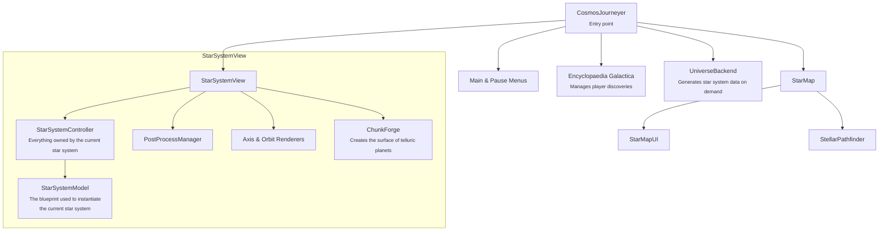
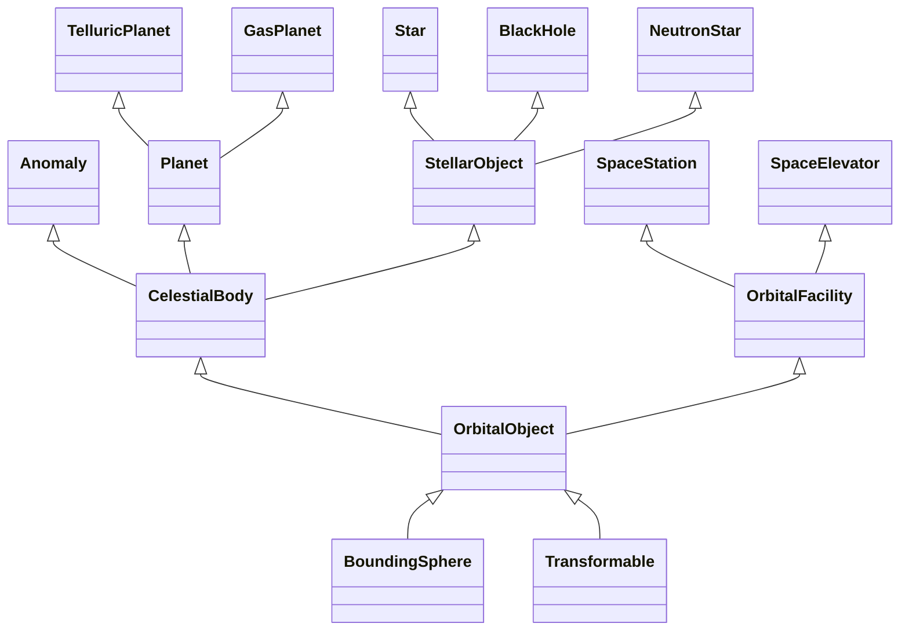

# Cosmos Journeyer's Architecture

If you are willing to contribute, this document will give you a good idea of where everything is and how it is organized.

All referenced TypeScript modules now live under `packages/game/src`. The workspace also contains additional tooling (see the root README for an overview).

## General architecture

The following diagram is not an inheritance diagram, but a composition diagram. Each arrow represents an "is part of" relationship.

For example, planets are part of the celestial bodies.

The entry point is `CosmosJourneyer`, which manages startup and the 3D context. It is also responsible for changing the view between the star system and the star map depending on the user's inputs. It is also responsible to control the pause and main menu.

The star map is responsible for displaying the position of the player in the galaxy and the nearby stars. It holds a UI that displays system data based on the star map selection. The star map can be used to plot itineraries accross the stars.

On the other hand, the star system view is responsible for displaying, loading and unloading star systems. The current star system is stored and managed inside the `StarSystemController` that is responsible from applying orbital mechanics.

The `StarSystemView` also holds the player's `ShipControls` that are used to control the spaceship.

The `UniverseBackend` is responsible for generating `StarSystemModel` data on demand. These immutable data objects contain all the necessary information necessary to populate a `StarSystemController`.

The `StarSystemModel` contains collections of `OrbitalObjectModel` that are in turn used to generate actual `OrbitalObject`. This decoupling of information and concrete 3d object is important to work on data of objects not shown on the screen (like for generating missions).

For each kind of `OrbitalObject` corresponds a kind of `OrbitalObjectModel`.

The different kinds are explained in the next section.

## Orbital Object's interfaces relations

Cosmos Journeyer avoids class inheritance in favor of interface inheritance to compose behaviors and properties.

It all starts with simple `Transformable` and `BoundingSphere`:
those are simple objects that possess a BaylonJS `TransformNode` for their position, rotation, scaling and a bounding volume to make simple calculations for distances.

An `OrbitalObject` builds on top of this by adding the notion of orbit and mass to enable orbital mechanics. As OrbitalObject is a mere interface, their movement in space is not directly implemented. Instead, look for `OrbitalObjectUtils` which contains functions to move `OrbitalObject` through space.

`CelestialBody` builds up on top of `OrbitalObject` by adding the notion of `radius`.

`CelestialBody` are spherical orbital objects that encompasses both planets, stellar objects and the space anomalies

`StellarObject` builds on top of `CelestialBody` by adding a light source and a temperature to control the color of the light source.

`Planet` builds on top of `CelestialBody` by adding atmospheres.

The other nodes are the concrete implementations of all these abstractions.
They can be found in their respective folders under `packages/game/src/ts/frontend` (`planets` for `TelluricPlanet` and `GasPlanet`, `stellarObjects` for `Star`, `BlackHole` and `NeutronStar`, and `spaceStations` for `SpaceStation`).
