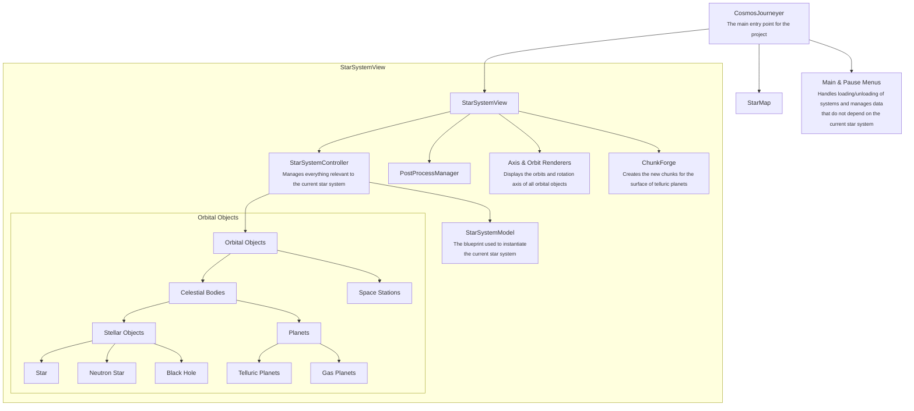
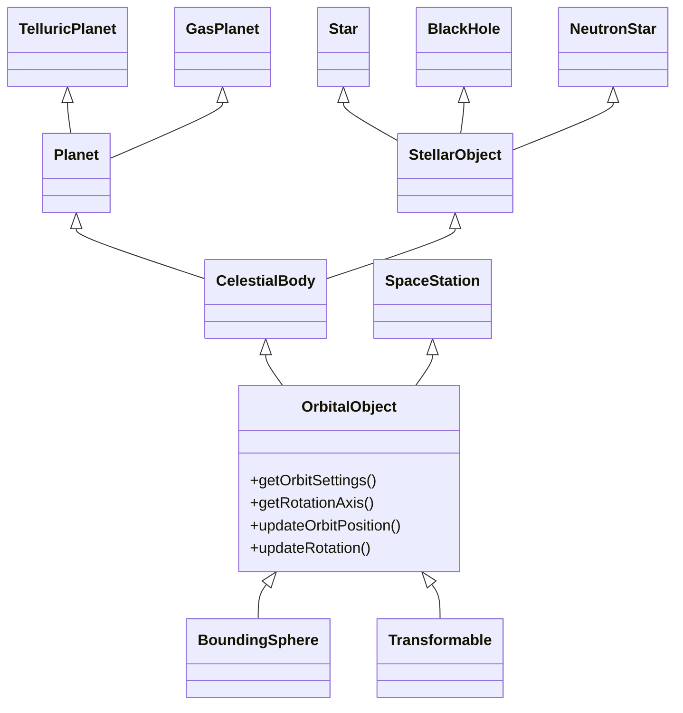

# Cosmos Journeyer's Architecture

Cosmos Journeyer is designed with a clear separation of concerns in mind. If you are willing to contribute, this document will give you a good idea of where everything is and how it is organized.

## General architecture

The following diagram is not an inheritance diagram, but a composition diagram. Each arrow represents an "is part of" relationship.

For example, planets are part of the celestial bodies.

## Orbital Object's interfaces relations

Even though you could argue the existence of an "is a" relationship between `CelestialBody` and `OrbitalObject`, I chose to avoid class inheritance for flexibility.

This means that in the previous diagram, in the `Orbital Objects` tree, are only classes the concrete types: `Star`, `BlackHole`, `NeutronStar`, `TelluricPlanet`, `GasPlanet`, and `SpaceStation`. The rest is only interfaces:

It all starts with simple `Transformable` and `BoundingSphere`:
those are simple objects that possess a BaylonJS `TransformNode` for their position, rotation, scaling and a bounding volume to make simple calculations for distances.

An `OrbitalObject` builds on top of this by adding the notion of orbit. They possess `OrbitProperties` that describes their motion around their `parent` which can be null in the case of some objects (think like stars).

`OrbitalObject` also possess `PhysicalProperties` that complement the `OrbitProperties` with information such as mass, axial tilting and rotation period.

To sum up, an `OrbitalObject` is an object that can rotate around another `OrbitalObject` and rotate on itself.

`CelestialBody` builds up on top of `OrbitalObject` by adding the notion of `BODY_TYPE` and `radius` that is expected from spherical objects.

`CelestialBody` are spherical orbital objects that encompasses both planets and stellar objects.

`StellarObject` builds on top of `CelestialBody` by adding a `PointLight` that is used to light up the scene. They also have a `STELLAR_TYPE` that describes their type (star, black hole, neutron star).

`Planet` builds on top of `CelestialBody` by adding new `PlanetPhysicalProperties` that describe their temperature and pressure. They also keep track of their number of moons.

The other nodes are the concrete implementations of all these abstractions.
They can be found in their respective folders (`planets` for `TelluricPlanet` and `GasPlanet`, `stellarObjects` for `Star`, `BlackHole` and `NeutronStar`, and spaceStations for `SpaceStation`).
