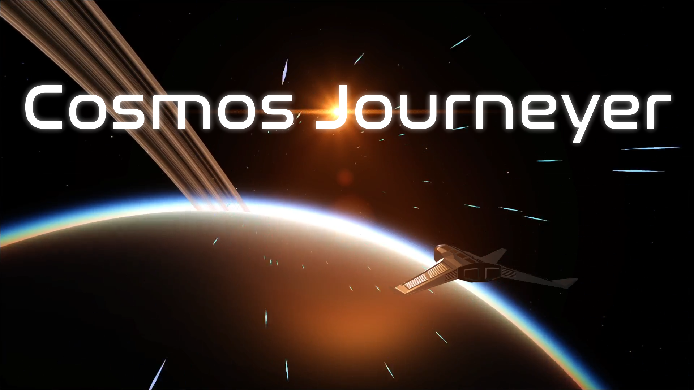

# Cosmos Journeyer


[](https://github.com/BarthPaleologue/CosmosJourneyer/actions/workflows/ci.yml)
[](https://github.com/BarthPaleologue/planetEngine/actions/workflows/pages/pages-build-deployment)
[](./LICENSE.md)

[](https://youtu.be/5pXZqHRShTE)

- [What is Cosmos Journeyer?](#what-is-cosmos-journeyer)
- [How to play](#how-to-play)
    - [Online](#online)
    - [Locally](#locally)
- [Community and support](#community-and-support)
- [My vision for the project](#my-vision-for-the-project)
    - [Themes and atmosphere](#themes-and-atmosphere)
    - [The narrative](#the-narrative)
    - [Gameplay](#gameplay)
    - [Main tutorial](#main-tutorial)
- [Why Cosmos Journeyer?](#why-cosmos-journeyer)
- [Contributing](#contributing)
- [Sponsor](#sponsor)
- [Documentation](#documentation)
- [Roadmap](#roadmap)
- [Features](#features)
- [Build](#build)
    - [Web](#web)
    - [Tauri](#tauri)
- [Contributors](#contributors)
- [License](#license)
- [Credits](#credits)
- [Special Thanks](#special-thanks)

## What is Cosmos Journeyer?

Cosmos Journeyer is a space exploration game running directly in the browser! Take your spaceship and witness the beauty of this virtually infinite universe.

From stellar black holes and fully explorable planets down to single grass blades, to asteroid fields, your journey will be unforgettable.

## How to play

### Online

You can play freely from the main website of the project at [cosmosjourneyer.com](https://cosmosjourneyer.com/)

### Locally

You can also play locally! You can get an installer for your system by going to [the latest release](https://github.com/BarthPaleologue/CosmosJourneyer/releases).

If you want the cutting edge version, follow these steps:

0. Install prerequisites:

- [Git](https://git-scm.com/) (install with your package manager or from https://git-scm.com/downloads)
- [Node.js](https://nodejs.org/) (version 20 or higher)
- [Pnpm](https://pnpm.io/) (install with `npm install -g pnpm`)

1. Clone the repo with `git clone https://github.com/BarthPaleologue/CosmosJourneyer.git`
2. Install the dependencies with `pnpm install`
3. Build the project with `pnpm build`
4. Serve the project with `pnpm serve:prod`
5. Play at http://localhost:8080

To update your local version, either download the latest installer or run `git pull` in your local install.

## Community and support

If you encounter any bugs or want to request features, please open an [issue](https://github.com/BarthPaleologue/CosmosJourneyer/issues) or send an email to <barth.paleologue@cosmosjourneyer.com>.

For general discussion and sharing screenshots, visit the [official subreddit](https://www.reddit.com/r/CosmosJourneyer/).

## My vision for the project

_Disclaimer: This vision for Cosmos Journeyer is a long-term guiding light and may not reflect the game’s current state. Development is ongoing, and there’s still a long way to go!_

### Themes and atmosphere

Cosmos Journeyer is a game centered on exploration: gazing at breathtaking cosmic landscapes, uncovering strange dimensional anomalies, encountering unexpected friends, and, of course, taking plenty of screenshots!

Unlike many space games where politics and combat dominate, here, the Universe itself takes center stage.

The goal is to evoke the following feelings in the player, in this order:

- The beauty of the cosmos: I want players’ hearts to be filled with wonder at the breathtaking creations of the universe.
- The vastness of the universe: This sense of wonder should be tinged with a subtle awareness of the universe’s overwhelming scale (enough to inspire awe, but not fear).
- A sense of purpose: The game's narrative should give direction to the player’s journey, infusing it with meaning.

### The narrative

The story is a personal journey: you are a young pilot embarking on your first mission as part of an exploration initiative, following in your father's footsteps.

Early in the game, you intercept a mysterious, disturbing message originating from the event horizon of a black hole. As if that weren’t strange enough, you soon realize that the message is from your father, who disappeared years ago during a mission.

This discovery sets you on a path through the strangest realms of the universe, where you’ll experience the sublime vastness of the cosmos, meet fascinating characters, and confront profound questions about the nature of reality.

“Everything that could be, is.”

### Gameplay

Players primarily pilot spaceships but can also explore the interiors of their ships on foot. The transition between piloting in space and walking on a planet’s surface is seamless, creating an immersive experience.

Spaceships can be upgraded and repaired at space stations in exchange for credits, which players earn by completing various exploration or trade missions as well as through free exploration. Since the game’s focus is not on grinding, mission rewards are intentionally generous.

The gameplay experience is also designed to be relaxing. I plan to incorporate unconventional, calming activities on planet surfaces, such as horseback riding, boat rides, and fishing, to add depth to the sense of exploration and relaxation.

### Main tutorial

Following the example set by the Great Plateau in _Zelda: Breath of the Wild_, the game begins in a self-contained star cluster that players cannot leave until they reach a specific milestone. This could be achieved by designing a star cluster that forms a disconnected graph, isolated from the rest of the universe through carefully chosen distances and a limited initial jump range.

This introductory star cluster would be fully handcrafted to make the best possible first impression on players. The story would guide them through significant locations in a logical sequence—such as space stations, a black hole, and a planet terminator—to introduce the narrative while also presenting mini-tutorials along the way.

Upon reaching the milestone, the player gains an extended jump range, granting access to the rest of the universe and opening up the game’s full scope.

## Why Cosmos Journeyer?

Why make Cosmos Journeyer when games like Elite Dangerous, Star Citizen, No Man's Sky or Kerbal Space Program already exist?

There are many reasons of course but here are the main ones:

- **Open Source**: Other games such as Elite are dependent on their studios to keep them alive. When the game will no
  longer be profitable, they will stop supporting it and then the games will be dead forever (see Kerbal Space Program 2 debacle for a recent example). By going open-source,
  Cosmos Journeyer will be able to evolve and improve continuously, without the need for a studio. Anyone can pick it up
  and make it their own.
- **Exploration Focused**: I always felt that exploration was the most interesting part of space games. At the same time
  I feel the other games are too focused on combat, trading or multiplayer content. I want Cosmos Journeyer to be an
  exploration first game, where your main drive is to discover cool things, take pictures, and dream for a bit.
- **Personal**: I don't know it's just so exciting to create an entire universe from scratch. It really is a dream
  comming true for me.

## Contributing

Contributions are welcome! There is too much to do for one person alone.

If you want to contribute, you will find guidelines and ideas [here](./CONTRIBUTING.md).

## Sponsor

Help me make Cosmos Journeyer a reality! The development is time-consuming but generates no revenue by itself.

Sponsoring the project on [Patreon](https://www.patreon.com/barthpaleologue)
or [GitHub Sponsors](https://github.com/sponsors/BarthPaleologue) will help secure the future of the project.

The project also has a ko-fi page at https://ko-fi.com/cosmosjourneyer if you feel like buying me a coffee!

### Documentation

The documentation is online at https://barthpaleologue.github.io/CosmosJourneyer/doc/

Additionally, the [ARCHITECTURE.md](./ARCHITECTURE.md) file contains a big picture explanation of the architecture of
the project.

To build it locally, run `npm run doc` and then `npm run serve:doc` to serve it at `localhost:8081`.

## Roadmap

You can have a look at the roadmap of the project on the website at https://cosmosjourneyer.com/

The deadlines are not set in stone and can be moved around as I am not working full time on the project.

## Features

Every telluric planet and moon has a surface that can be explored by the player using a spaceship, or by foot!


Cosmos Journeyer allows to travel from one celestial body to another without any loading screen, giving the player a
seamless experience while exploring.


Planet surfaces are filled with procedural vegetation and rocks and butterflies to make them feel more alive.


Cosmos Journeyer generates a virtually infinite amount of star systems that all have a star, often planets, and
sometimes moons.


## Build

First, clone the repository and install the dependencies with `pnpm install`.

### Web

To build the web version of Cosmos Journeyer, run `pnpm build`. Everything will be built in the `dist` folder.

To start the production server version, run `pnpm serve:prod`. The development version can be started with `pnpm serve`.

### Tauri

Cosmos Journeyer can be built as a desktop application using Tauri!

First you will need a bazillion dependencies, here is a list of some of them if you are using a Debian based OS:

```bash
sudo apt install -y libwebkit2gtk-4.0-dev libgtk-3-dev libsoup2.4-dev libjavascriptcoregtk-4.0-dev librsvg2-dev libwebkit2gtk-4.0-dev libappindicator3-dev patchelf
```

Then you can build the application with `pnpm tauri build` or run it with `pnpm tauri dev`.

## Contributors

Thank you to all the people who have contributed to Cosmos Journeyer!


## License

Cosmos Journeyer is a free and open-source software licensed under the terms of the GNU AGPL License. Look at the `LICENSE.md` file for the exact terms.

## Credits

All credits can be found in [the credits panel](./src/html/mainMenu.html) of the game.

## Special Thanks

- Martin Molli for his fearless refactoring of the messy code base in its early days
- The people from [BabylonJS](https://www.babylonjs.com/) for their amazing work on the BabylonJS framework and their
  help on the forum
- My family for their continuous support
