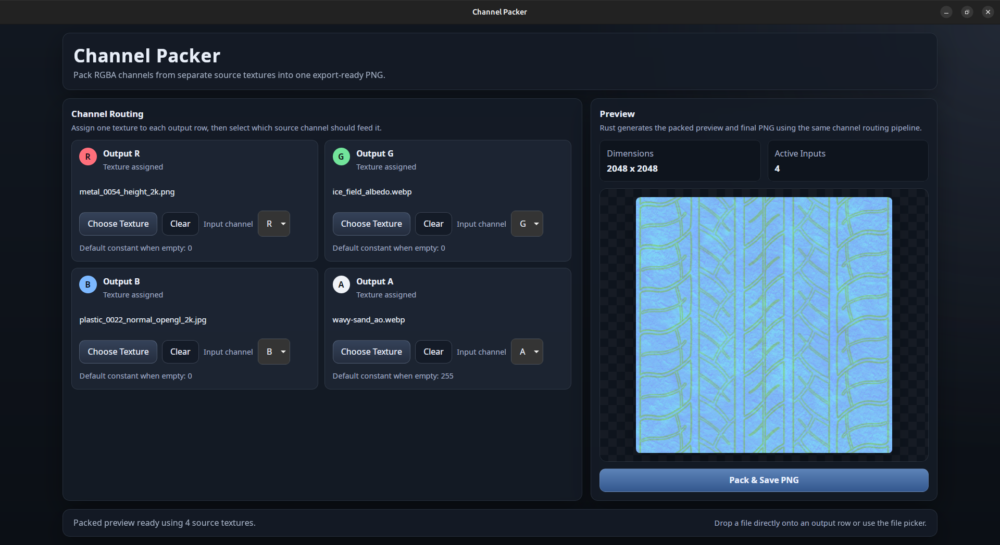

# Channel Packer

Channel Packer is a standalone web utility for packing RGBA output textures from channels of multiple source textures.



## Features

- Assign a texture to each output channel (`R`, `G`, `B`, `A`)
- Choose which source channel should feed each output channel
- Drag and drop textures directly onto channel rows
- Preview the packed result before export
- Download the packed texture as a PNG

## Development

Run the web app in development mode:

```sh
pnpm dev:channel-packer
```

Build the frontend bundle:

```sh
pnpm build:channel-packer
```
