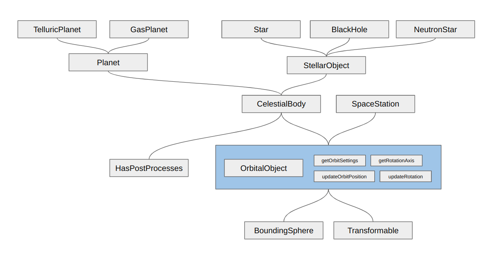

# Architecture of interface spanning from simple Transforms to complex Celestial bodies and Space stations:

This folder contains all the abstraction necessary to the architecture of the image. 

This means all the node except the leaves (upper nodes) which are the actual concrete implementation of celestial bodies and space stations.

It all starts with simple `Transformable` and `BoundingSphere`: 
those are simple objects that possess a BaylonJS `TransformNode` for their position, rotation, scaling and a bounding volume to make simple calculations for distances.

An `OrbitalObject` builds on top of this by adding the notion of orbit. They possess `OrbitProperties` that describes their motion around their `parent` which can be null in the case of some objects (think like stars).

`OrbitalObject` also possess `PhysicalProperties` that complement the `OrbitProperties` with information such as mass, axial tilting and rotation period.

To sum up, an `OrbitalObject` is an object that can rotate around another `OrbitalObject` and rotate on itself.

`CelestialBody` builds up on top of `OrbitalObject` by adding the notion of `BODY_TYPE` and `radius` that is expected from spherical objects.

`CelestialBody` are spherical orbital objects that encompasses both planets and stellar objects. 
They can have specific post-processes applied to them (like atmosphere, clouds, rings...), which is why they also implement `HasPostProcesses`.

`StellarObject` builds on top of `CelestialBody` by adding a `PointLight` that is used to light up the scene. They also have a `STELLAR_TYPE` that describes their type (star, black hole, neutron star).

`Planet` builds on top of `CelestialBody` by adding new `PlanetPhysicalProperties` that describe their temperature and pressure. They also keep track of their number of moons.

The other nodes are the concrete implementations of all these abstractions.
They can be found in their respective folders (`planets` for `TelluricPlanet` and `GasPlanet`, `stellarObjects` for `Star`, `BlackHole` and `NeutronStar`, and spaceStations for `SpaceStation`).